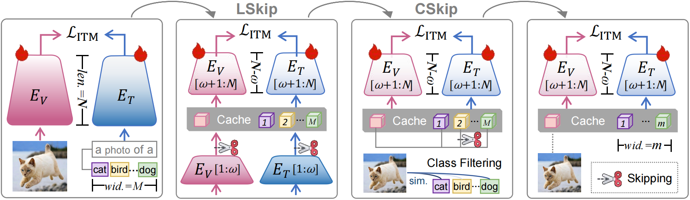
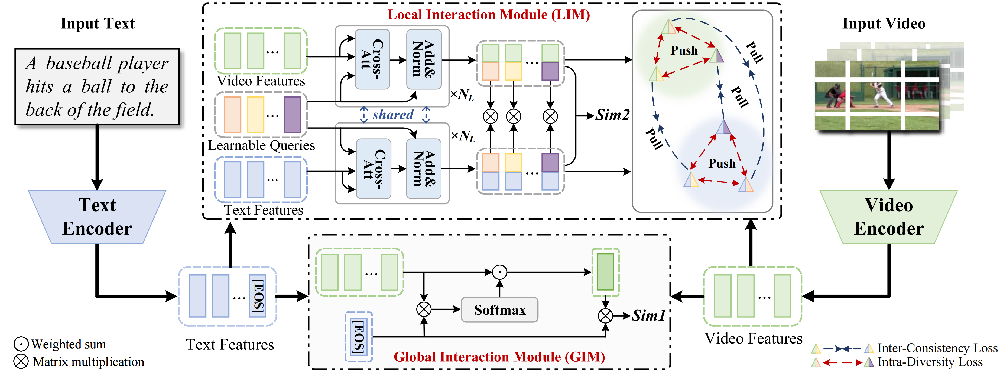
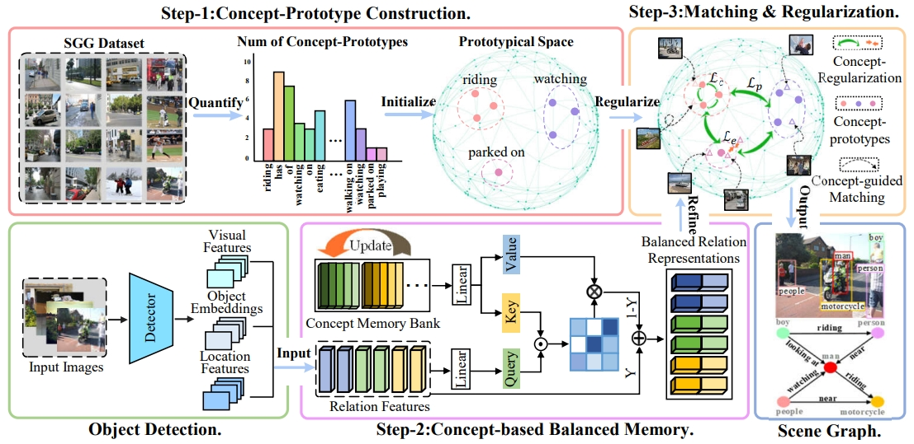
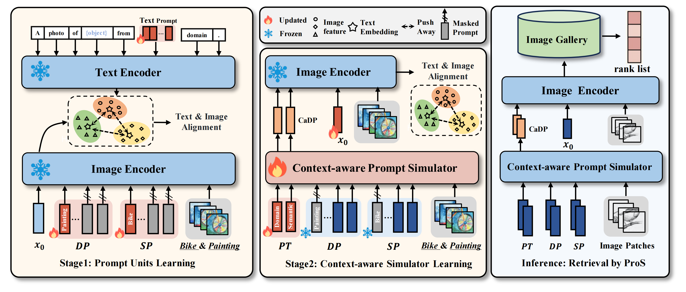
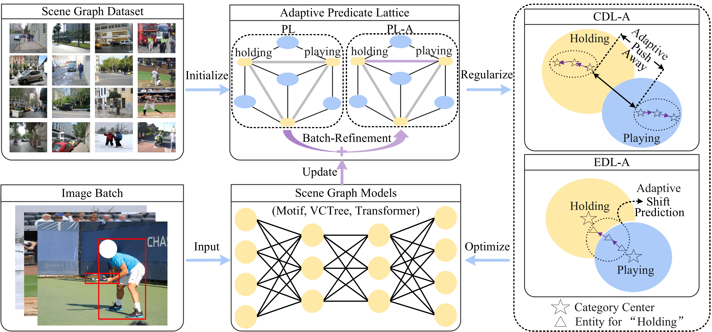
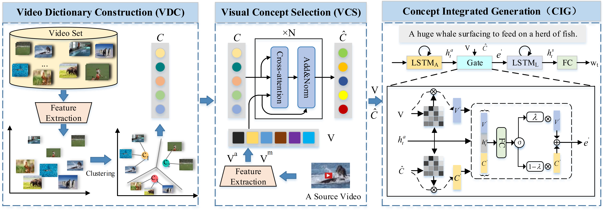
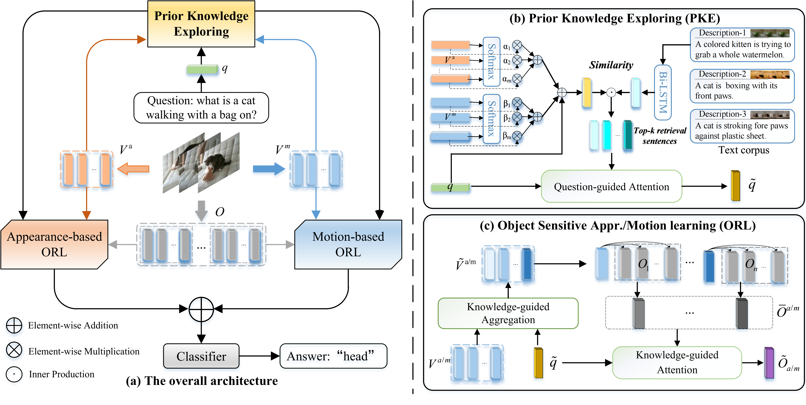
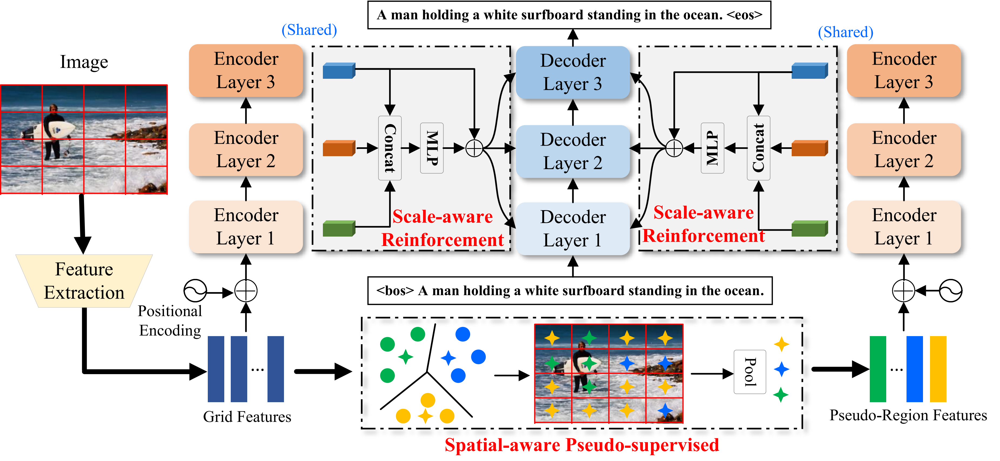








I am Pengpeng Zeng (曾鹏鹏), currently a Researcher in the School of Computer Science and Technology at Tongji University, China. I received my Ph.D. degree in 2023 from the School of Computer Science and Engineering, University of Electronic Science and Technology of China (UESTC), under the supervision of Prof. [Jingkuan Song](https://cfm.uestc.edu.cn/~songjingkuan/), Prof. [Lianli Gao](https://lianligao.github.io/), and Prof. [Heng Tao Shen](https://cfm.uestc.edu.cn/~shenht/).

My research interests include Machine Learning, Deep Learning, AI-Generated Content (AIGC), Computer Vision, and Reinforcement Learning etc.

If you are interested in related topics or potential collaborations, please feel free to get in touch: **is.pengpengzeng@gmail.com**.

# 🔥 News
- *2025.05*: Two papers accepted by ACL 2025!
- *2025.05*: One paper accepted by TIP!
- *2025.02*: One paper accepted by CVPR 2025!
- *2025.02*: One paper accepted by TIP!
- *2024.07*: One paper accepted by ACM MM 2024!
- *2024.07*: One paper accepted by TCSVT!
- *2024.02*: One paper accepted by CVPR 2024!

<!--
- *2023.11*: One paper accepted by TCSVT!
- *2023.09*: One paper accepted by TNNLS!
- *2023.07*: One paper accepted by ACM MM2023!
- *2023.07*: One paper accepted by TPAMI!
- *2023.07*: One paper accepted by TMM!
- *2023.07*: One paper accepted by TCSVT!
- *2023.01*: One paper accepted by PR!
-->

# 📝 Publications 
Selected publications are listed below. For the full list, please see my [Google Scholar](https://scholar.google.com/citations?user=Zs0PWb4AAAAJ&hl=en).

CVPR 2025

  
[**Skip Tuning: Pre-trained Vision-Language Models are Effective and Efficient Adapters Themselves**](https://arxiv.org/abs/2412.11509) 
Shihan Wu, Ji Zhang, **Pengpeng Zeng**, Lianli Gao, Jingkuan Song, Heng Tao Shen 
IEEE/CVF Conference on Computer Vision and Pattern Recognition (**CVPR**), 2025 
[[Paper]](https://arxiv.org/abs/2412.11509)[[Code]](https://github.com/Koorye/SkipTuning)

TIP 2025

**Text-Video Retrieval with Global-Local Semantic Consistent Learning** 
Haonan Zhang, **Pengpeng Zeng**, Lianli Gao, Jingkuan Song, Yihang Duan, Xinyu Lyu, Heng Tao Shen 
IEEE Transactions on Image Processing (**TIP**), 2025 
[Paper][[Code]](https://github.com/zchoi/GLSCL) 

TIP 2025

[**Multi-Concept Learning for Scene Graph Generation**](https://ieeexplore.ieee.org/document/10909340) 
Xinyu Lyu, Lianli Gao, Junlin Xie, **Pengpeng Zeng**, Yulu Tian, Jie Shao, Heng Tao Shen 
IEEE Transactions on Image Processing (**TIP**), 2025 
[[Paper]](https://ieeexplore.ieee.org/document/10909340)[[Code]](https://github.com/XinyuLyu/G-USGG) 

CVPR 2024

[**ProS: Prompting-to-simulate Generalized knowledge for Universal Cross-Domain Retrieval**](https://openaccess.thecvf.com/content/CVPR2024/papers/Fang_ProS_Prompting-to-simulate_Generalized_knowledge_for_Universal_Cross-Domain_Retrieval_CVPR_2024_paper.pdf) 
Kaipeng Fang, Jingkuan Song, Lianli Gao, **Pengpeng Zeng**, Zhi-Qi Cheng, Xiyao Li, Heng Tao Shen 
IEEE/CVF Conference on Computer Vision and Pattern Recognition (**CVPR**), 2024 
[[Paper]](https://openaccess.thecvf.com/content/CVPR2024/papers/Fang_ProS_Prompting-to-simulate_Generalized_knowledge_for_Universal_Cross-Domain_Retrieval_CVPR_2024_paper.pdf)[[Code]](https://github.com/kaipengfang/ProS)

TPAMI 2023

[**Adaptive Fine-Grained Predicates Learning for Scene Graph Generation**](https://ieeexplore.ieee.org/document/10192357) 
Xinyu Lyu, Lianli Gao, **Pengpeng Zeng**, Heng Tao Shen, Jingkuan Song 
IEEE Transactions on Pattern Analysis and Machine Intelligence (**TPAMI**), 2023 
[[Paper]](https://ieeexplore.ieee.org/document/10192357)[[Code]](https://github.com/XinyuLyu/FGPL)

TNNLS 2023

[**Visual Commonsense-aware Representation Network for Video Captioning**](https://arxiv.org/pdf/2211.09469) 
**Pengpeng Zeng**, Haonan Zhang, Lianli Gao, Xiangpeng Li, Jin Qian, Heng Tao Shen 
IEEE Transactions on Neural Networks and Learning Systems (**TNNLS**), 2023 
[[Paper]](https://arxiv.org/pdf/2211.09469)[[Code]](https://github.com/zchoi/VCRN)

TIP 2022

[**Video Question Answering with Prior Knowledge and Object-sensitive Learning**](https://ieeexplore.ieee.org/document/9882977) 
**Pengpeng Zeng**, Haonan Zhang, Lianli Gao, Jingkuan Song, Heng Tao Shen 
IEEE Transactions on Image Processing (**TIP**), 2022 
[[Paper]](https://ieeexplore.ieee.org/document/9882977)[[Code]](https://github.com/zchoi/PKOL)

IJCAI 2022

[**S2 Transformer for Image Captioning**](https://www.ijcai.org/proceedings/2022/0224.pdf) 
**Pengpeng Zeng**, Haonan Zhang, Jingkuan Song, Lianli Gao 
International Joint Conference on Artificial Intelligence (**IJCAI**), 2022 
[[Paper]](https://www.ijcai.org/proceedings/2022/0224.pdf)[[Code]](https://github.com/zchoi/S2-Transformer)

- `arXiv 2025` [Towards Generalized and Training-Free Text-Guided Semantic Manipulation](https://arxiv.org/abs/2504.17269), Yu Hong, Xiao Cai, **Pengpeng Zeng**, Shuai Zhang, Jingkuan Song, Lianli Gao, Heng Tao Shen.

- `arXiv 2025` [CFReID: Continual Few-shot Person Re-Identification](https://arxiv.org/abs/2503.18469), Hao Ni, Lianli Gao, **Pengpeng Zeng**, Heng Tao Shen, Jingkuan Song. [[Code]](https://github.com/haoni0812/MDA.git)

- `arXiv 2024` [GT23D-Bench: A Comprehensive General Text-to-3D Generation Benchmark](https://arxiv.org/abs/2412.09997), Sitong Su, Xiao Cai, Lianli Gao, **Pengpeng Zeng**, Qinhong Du, Mengqi Li, Heng Tao Shen, Jingkuan Song. 

- `arXiv 2024` [SeMv-3D: Towards Semantic and Mutil-view Consistency simultaneously for General Text-to-3D Generation with Triplane Priors](https://arxiv.org/pdf/2410.07658), Xiao Cai, **Pengpeng Zeng**, Lianli Gao, Junchen Zhu, Jiaxin Zhang, Sitong Su, Heng Tao Shen, Jingkuan Song.

- ``ACL 2025`` [OmniCharacter: Towards Immersive Role-Playing Agents with Seamless Speech-Language Personality Interaction](https://arxiv.org/pdf/2505.20277), Haonan Zhang, Run Luo, Xiong Liu, Yuchuan Wu, Ting-En Lin, **Pengpeng Zeng**, Qiang Qu, Feiteng Fang, Min Yang, Lianli Gao, Jingkuan Song, Fei Huang, Yongbin Li. [[Code]](https://github.com/zchoi/OmniCharacter)

- `ACL 2025 (findings)` [MMEvol: Empowering multimodal large language models with evol-instruct](https://arxiv.org/pdf/2409.05840?), Run Luo, Haonan Zhang, Longze Chen, Ting-En Lin, Xiong Liu, Yuchuan Wu, Min Yang, Minzheng Wang, **Pengpeng Zeng**, Lianli Gao, Heng Tao Shen, Yunshui Li, Xiaobo Xia, Fei Huang, Jingkuan Song, Yongbin Li. [[Project]](https://mmevol.github.io/)[[Code]](https://github.com/AlibabaResearch/DAMO-ConvAI/tree/main/mmevol/)

- `ACM MM 2024` [MPT: Multi-grained Prompt Tuning for Text-Video Retrieval](https://dl.acm.org/doi/abs/10.1145/3664647.3680839), Haonan Zhang, **Pengpeng Zeng**, Lianli Gao, Jingkuan Song, Heng Tao Shen. [[Code]](https://github.com/zchoi/MPT)

- `TCSVT 2024` [UMP: Unified Modality-aware Prompt Tuning for Text-Video Retrieval](https://ieeexplore.ieee.org/abstract/document/10599510/), Haonan Zhang, **Pengpeng Zeng**, Lianli Gao, Jingkuan Song, Heng Tao Shen. [[Code]](https://github.com/zchoi/UMP_TVR)

- `ACM MM 2024` [Depth-aware sparse transformer for video-language learning](https://dl.acm.org/doi/abs/10.1145/3581783.3611714), Haonan Zhang, Lianli Gao, **Pengpeng Zeng**, Alan Hanjalic, Heng Tao Shen. [[Code]](https://github.com/zchoi/DAST)

- `TCSVT 2023` [SPT: Spatial pyramid transformer for image captioning](https://ieeexplore.ieee.org/abstract/document/10328641/), Haonan Zhang, **Pengpeng Zeng**, Lianli Gao, Xinyu Lyu, Jingkuan Song, Heng Tao Shen. [[Code]](https://github.com/zchoi/SPT)

- `TMM 2023` [Memory-based augmentation network for video captioning](https://ieeexplore.ieee.org/abstract/document/10183355/), Shuaiqi Jing, Haonan Zhang, **Pengpeng Zeng**, Lianli Gao, Jingkuan Song, Heng Tao Shen. [[Code]](https://github.com/zchoi/MAN)

- `NeurIPS 2022` [A Differentiable Semantic Metric Approximation in Probabilistic Embedding for Cross-Modal Retrieval](https://proceedings.neurips.cc/paper_files/paper/2022/file/4e786a87e7ae249de2b1aeaf5d8fde82-Paper-Conference.pdf), Hao Li, Jingkuan Song, Lianli Gao, **Pengpeng Zeng**, Haonan Zhang, Gongfu Li. [[Code]](https://github.com/leolee99/2022-NeurIPS-DAA)

- `TIP 2021` [Hierarchical representation network with auxiliary tasks for video captioning and video question answering](https://ieeexplore.ieee.org/abstract/document/9592722/), Lianli Gao, Yu Lei, **Pengpeng Zeng**, Jingkuan Song, Meng Wang, Heng Tao Shen. [[Code]](https://github.com/Riesling00/HRNAT)

- `ACM MM 2021`  (**oral**) [Conceptual and Syntactical Cross-modal Alignment with Cross-level Consistency for Image-Text Matching](https://dl.acm.org/doi/10.1145/3474085.3475380), **Pengpeng Zeng**, Lianli Gao, Xinyu Lyu, Shuaiqi Jing, Jingkuan Song.

# 🎖 Honors and Services

- **Honors**

  - *2022.12* Outstanding Student of UESTC.
  - *2022.10* National Scholarship.
  
- **Academic Services**

  - IEEE TPAMI, IEEE TIP, IEEE TMM, IEEE TNNLS, ICCV, CVPR, ECCV, AAAI, MM, etc.
    
- **Grand Challenges**
  - _ICME 2024_: 1st Place Winner on Attribute Recognition track of Multi-Modal Video Reasoning and Analyzing Competition (MMVRAC) 
  - _ICME 2024_: 1st Place Winner on Person Reidentification track of Multi-Modal Video Reasoning and Analyzing Competition (MMVRAC)
  - _Ingenuity Cup 2024_: 2nd Place award in the Grand Final of the 1st “Ingenuity Cup” National Artificial Intelligence Innovation Application Competition.
  - _Ingenuity Cup 2024_: 1st Place award on the Multimodal Technology, Technology Innovation Track of the 1st “Ingenuity Cup” National Artificial Intelligence Innovation Application Competition.
  - _ECCV 2022_: DeeperAction Challenge 3rd place award on Track 4 Kinetics-TPS Challenge on Part-level Action Parsing.
  - _OPPO 2021_: Security Challenge 3rd Place award.

# 📖 Educations
- *2019.09 - 2023.06*, Ph.D, Computer Science and Technology, University of Electronic Science and Technology of China (UESTC).
- *2016.09 - 2019.06*, M.S., Computer Technology, University of Electronic Science and Technology of China (UESTC).
- *2012.09 - 2016.06*, B.S., Digital Media Technology, Xi'an University of Technology (XUT).

# 💻 Research Grants
- *2025.01 - 2027.12*, Young Scientists Fund of the National Natural Science Foundation of China: "Research on Efficient Cross-Modal Retrieval Theory and Technology for Open Scenarios", **Lead PI**
- *2025.01 - 2026.12*, Young Scientists Fund of the Sichuan Provincial Department of Science and Technology: "Theoretical and Methodological Study on Efficient Adaptive Learning for Open-Scenario Multimodal Autonomous Intelligence", **Lead PI**
- *2022.04 - 2023.11*, Sichuan Science and Technology Program of the Sichuan Provincial Department of Science and Technology: "Research on Vision-Text Collaborative Learning for Semantic Understanding", **Lead PI**

<!--
# 💬 Invited Talks
- *2022.05*, ChinaMM 2022 (Technical Forum: End-to-End Image Caption Generation Based on Visual Region Aggregation and Bidirectional Interaction), Guiyang, Guizhou. 

# 💻 Internships
- *2018.06 - 2018.09*, Deep learning for visual question answering, JD AI CV-Lab, Advisor: Dr. [Wu liu](https://www.drliuwu.com/)
-->

 visitors since Jun 2025.

