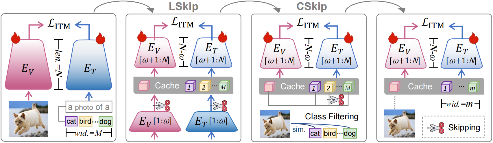
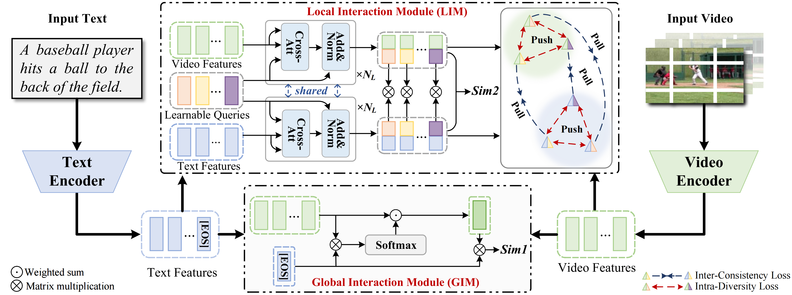
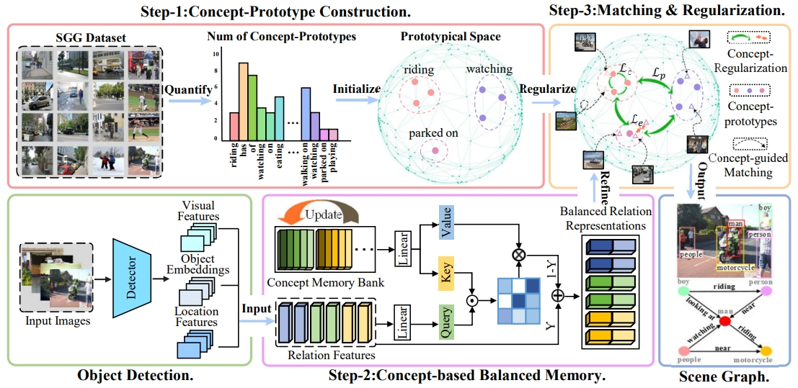
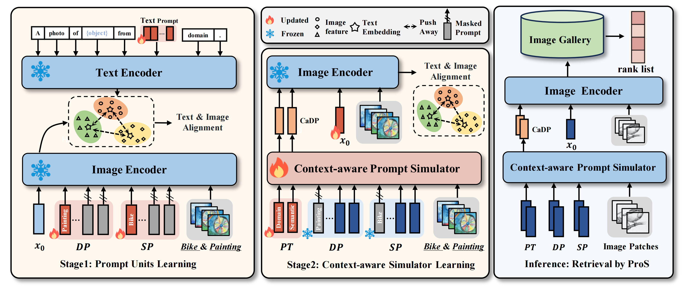
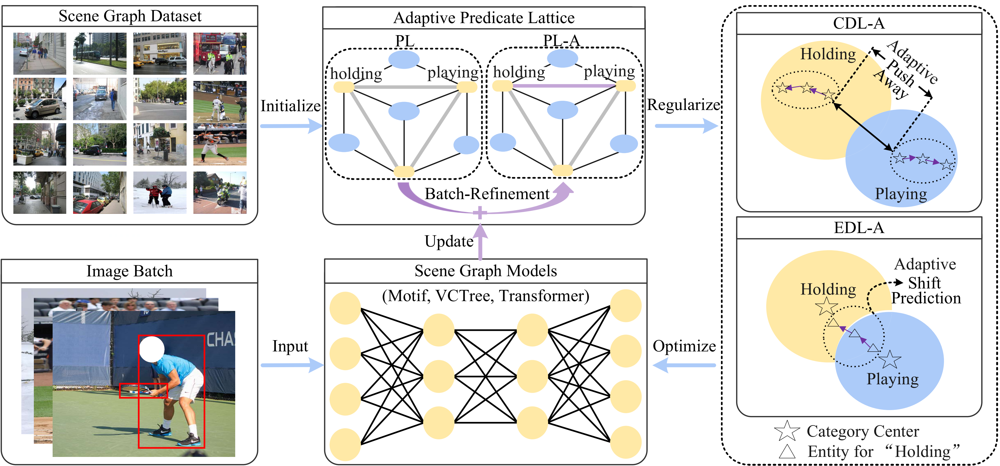
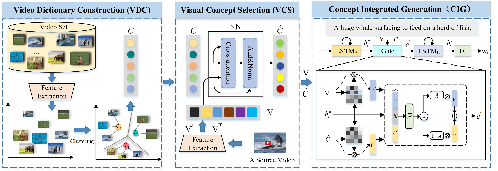
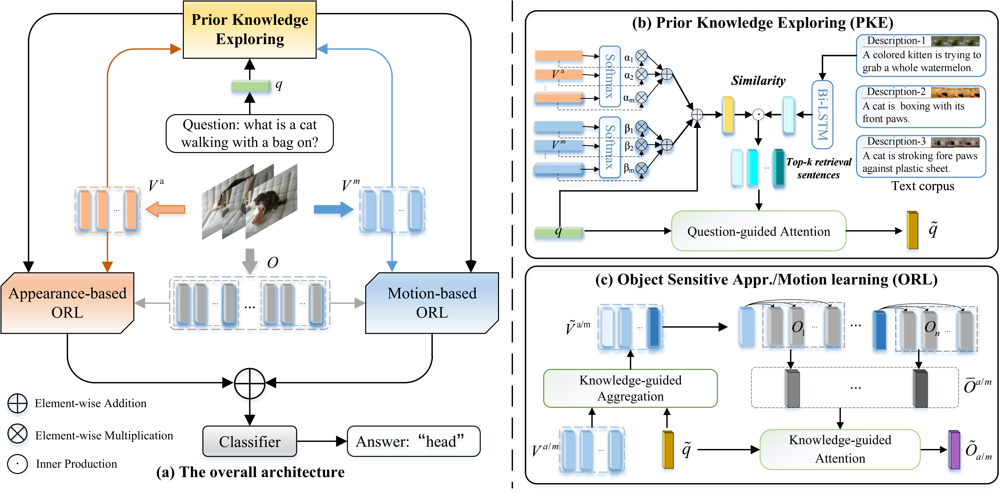
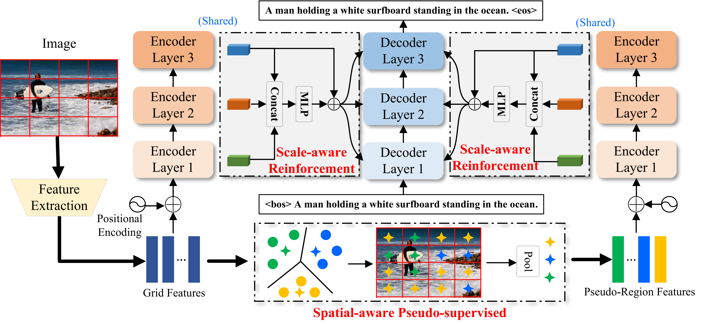








I am Pengpeng Zeng (曾鹏鹏), currently a Researcher in the School of Computer Science and Technology at Tongji University, China. I received my Ph.D. degree in 2023 from the School of Computer Science and Engineering, University of Electronic Science and Technology of China (UESTC), under the supervision of Prof. [Jingkuan Song](https://cfm.uestc.edu.cn/~songjingkuan/), Prof. [Lianli Gao](https://lianligao.github.io/), and Prof. [Heng Tao Shen](https://cfm.uestc.edu.cn/~shenht/).

My research interests include Robot Learning, Multimodal Learning, and Computer Vision.

We are currently looking for 2–3 motivated interns to join our research projects in Robot Learning and Multimodal Learning. If you are interested in these topics or potential collaboration opportunities, please feel free to send your CV to **[is.pengpengzeng@gmail.com](mailto:is.pengpengzeng@gmail.com)**.

# 🔥 News
- *2026.09*: One paper accepted by CoRL 2026!
- *2026.07*: One paper accepted by ACM MM 2026!
- *2026.06*: One paper accepted by ECCV 2026!
- *2026.05*: Three papers accepted by ICML 2026!
- *2026.04*: One paper accepted by TPAMI 2026!
- *2026.04*: One paper accepted by IJCV 2026!
- *2026.03*: One paper accepted by TMM 2026!
- *2026.02*: One paper accepted by TIP 2026!

<!--
- *2025.07*: One paper accepted by ACM MM 2025!
- *2025.05*: Two papers accepted by ACL 2025!
- *2025.05*: One paper accepted by TIP!
- *2025.02*: One paper accepted by CVPR 2025!
- *2025.02*: One paper accepted by TIP!
- *2024.07*: One paper accepted by ACM MM 2024!
- *2024.07*: One paper accepted by TCSVT!
- *2024.02*: One paper accepted by CVPR 2024!
- *2023.11*: One paper accepted by TCSVT!
- *2023.09*: One paper accepted by TNNLS!
- *2023.07*: One paper accepted by ACM MM2023!
- *2023.07*: One paper accepted by TPAMI!
- *2023.07*: One paper accepted by TMM!
- *2023.07*: One paper accepted by TCSVT!
- *2023.01*: One paper accepted by PR!
-->

# 📝 Publications

Selected publications are listed below. For the full list, please see my Google Scholar profile.

* `CoRL 2026` Sim-and-Human Co-training for Data-Efficient and Scene-Generalizable Bimanual Manipulation, Kaipeng Fang, Weiqing Liang, Yuyang Li, Ji Zhang, **Pengpeng Zeng**, Lianli Gao, Jingkuan Song, Heng Tao Shen.

* `ACM MM 2026` SpatialGS: Relative Spatial Regularization in Gaussian Splatting for Layout-guided Text-to-3D Generation, Qinhong Du, Xiao Cai, **Pengpeng Zeng**, Ji Zhang, Jingkuan Song, Lianli Gao.

* `ECCV 2026` From One-to-One to Many-to-Many: Dynamic Cross-Layer Injection for Deep Vision-Language Fusion, Cheng Chen, Yuyu Guo, **Pengpeng Zeng**, Jingkuan Song, Peng Di, Hang Yu, Lianli Gao.

* `ICML 2026` JANUS-LORA: A Balanced Low-Rank Adaptation for Continual Learning, Cheng Chen, **Pengpeng Zeng**, Yuyu Guo, Jingkuan Song, Heng Tao Shen, Lianli Gao.

* `ICML 2026` Cross-Tactile Sensor Representation Learning, Yan Zhang, Zheng Wang, **Pengpeng Zeng**, Xing Xu, Jingkuan Song, Heng Tao Shen.

* `ICML 2026` TIMI: Training-Free Image-to-3D Multi-Instance Generation with Spatial Fidelity, Xiao Cai, Lianli Gao, **Pengpeng Zeng**, Ji Zhang, Heng Tao Shen, Jingkuan Song.

* `TPAMI 2026` OmniCharacter++: Towards Comprehensive Benchmark for Realistic Role-Playing Agents, Haonan Zhang, **Pengpeng Zeng**, Ji Zhang, Jingkuan Song, Nicu Sebe, Heng Tao Shen, Lianli Gao.

* `IJCV 2026` Generalized Image Retrieval with Off-The-Shelf Quantizer, **Pengpeng Zeng**, Yihang Duan, Xiaosu Zhu, Jingkuan Song, Lianli Gao, Nicu Sebe, Hengtao Shen.

* `TMM 2026` Structure-aware Prompt Adaptation from Seen to Unseen for Open-Vocabulary Compositional Zero-Shot Learning, Yihang Duan, Jiong Wang, **Pengpeng Zeng**, Ji Zhang, Lei Zhao, Chong Wang, Jingkuan Song, Lianli Gao.

* `TIP 2026` SeMv-3D: Towards Semantic and Mutil-view Consistency simultaneously for General Text-to-3D Generation with Triplane Priors, Xiao Cai, **Pengpeng Zeng**, Lianli Gao, Sitong Su, Heng Tao Shen, Jingkuan Song.

* `CVPR 2025` Skip Tuning: Pre-trained Vision-Language Models are Effective and Efficient Adapters Themselves, Shihan Wu, Ji Zhang, **Pengpeng Zeng**, Lianli Gao, Jingkuan Song, Heng Tao Shen.

* `TIP 2025` Text-Video Retrieval with Global-Local Semantic Consistent Learning, Haonan Zhang, **Pengpeng Zeng**, Lianli Gao, Jingkuan Song, Yihang Duan, Xinyu Lyu, Heng Tao Shen.

* `TIP 2025` Multi-Concept Learning for Scene Graph Generation, Xinyu Lyu, Lianli Gao, Junlin Xie, **Pengpeng Zeng**, Yulu Tian, Jie Shao, Heng Tao Shen.

* `ACM MM 2025` AICL: Action In-Context Learning For Text-to-Video Generation, Jianzhi Liu, Junchen Zhu, **Pengpeng Zeng**, Lianli Gao, Heng Tao Shen, Jingkuan Song.

* `ACL 2025` OmniCharacter: Towards Immersive Role-Playing Agents with Seamless Speech-Language Personality Interaction, Haonan Zhang, Run Luo, Xiong Liu, Yuchuan Wu, Ting-En Lin, **Pengpeng Zeng**, Qiang Qu, Feiteng Fang, Min Yang, Lianli Gao, Jingkuan Song, Fei Huang, Yongbin Li.

* `ACL 2025 (Findings)` MMEvol: Empowering Multimodal Large Language Models with Evol-Instruct, Run Luo, Haonan Zhang, Longze Chen, Ting-En Lin, Xiong Liu, Yuchuan Wu, Min Yang, Minzheng Wang, **Pengpeng Zeng**, Lianli Gao, Heng Tao Shen, Yunshui Li, Xiaobo Xia, Fei Huang, Jingkuan Song, Yongbin Li.

* `CVPR 2024` ProS: Prompting-to-simulate Generalized Knowledge for Universal Cross-Domain Retrieval, Kaipeng Fang, Jingkuan Song, Lianli Gao, **Pengpeng Zeng**, Zhi-Qi Cheng, Xiyao Li, Heng Tao Shen.

* `ACM MM 2024` MPT: Multi-grained Prompt Tuning for Text-Video Retrieval, Haonan Zhang, **Pengpeng Zeng**, Lianli Gao, Jingkuan Song, Heng Tao Shen.

* `TCSVT 2024` UMP: Unified Modality-aware Prompt Tuning for Text-Video Retrieval, Haonan Zhang, **Pengpeng Zeng**, Lianli Gao, Jingkuan Song, Heng Tao Shen.

* `ACM MM 2024` Depth-aware Sparse Transformer for Video-Language Learning, Haonan Zhang, Lianli Gao, **Pengpeng Zeng**, Alan Hanjalic, Heng Tao Shen.

* `TPAMI 2023` Adaptive Fine-Grained Predicates Learning for Scene Graph Generation, Xinyu Lyu, Lianli Gao, **Pengpeng Zeng**, Heng Tao Shen, Jingkuan Song.

* `TNNLS 2023` Visual Commonsense-aware Representation Network for Video Captioning, **Pengpeng Zeng**, Haonan Zhang, Lianli Gao, Xiangpeng Li, Jin Qian, Heng Tao Shen.

* `TCSVT 2023` SPT: Spatial Pyramid Transformer for Image Captioning, Haonan Zhang, **Pengpeng Zeng**, Lianli Gao, Xinyu Lyu, Jingkuan Song, Heng Tao Shen.

* `TMM 2023` Memory-based Augmentation Network for Video Captioning, Shuaiqi Jing, Haonan Zhang, **Pengpeng Zeng**, Lianli Gao, Jingkuan Song, Heng Tao Shen.

* `NeurIPS 2022` A Differentiable Semantic Metric Approximation in Probabilistic Embedding for Cross-Modal Retrieval, Hao Li, Jingkuan Song, Lianli Gao, **Pengpeng Zeng**, Haonan Zhang, Gongfu Li.

* `TIP 2022` Video Question Answering with Prior Knowledge and Object-sensitive Learning, **Pengpeng Zeng**, Haonan Zhang, Lianli Gao, Jingkuan Song, Heng Tao Shen.

* `IJCAI 2022` S2 Transformer for Image Captioning, **Pengpeng Zeng**, Haonan Zhang, Jingkuan Song, Lianli Gao.

* `TIP 2021` Hierarchical Representation Network with Auxiliary Tasks for Video Captioning and Video Question Answering, Lianli Gao, Yu Lei, **Pengpeng Zeng**, Jingkuan Song, Meng Wang, Heng Tao Shen.

* `ACM MM 2021` (**Oral**) Conceptual and Syntactical Cross-modal Alignment with Cross-level Consistency for Image-Text Matching, **Pengpeng Zeng**, Lianli Gao, Xinyu Lyu, Shuaiqi Jing, Jingkuan Song.

<!-- 

CVPR 2025

  
[**Skip Tuning: Pre-trained Vision-Language Models are Effective and Efficient Adapters Themselves**](https://arxiv.org/abs/2412.11509) 
Shihan Wu, Ji Zhang, **Pengpeng Zeng**, Lianli Gao, Jingkuan Song, Heng Tao Shen 
IEEE/CVF Conference on Computer Vision and Pattern Recognition (**CVPR**), 2025 
[[Paper]](https://arxiv.org/abs/2412.11509)[[Code]](https://github.com/Koorye/SkipTuning)

TIP 2025

**Text-Video Retrieval with Global-Local Semantic Consistent Learning** 
Haonan Zhang, **Pengpeng Zeng**, Lianli Gao, Jingkuan Song, Yihang Duan, Xinyu Lyu, Heng Tao Shen 
IEEE Transactions on Image Processing (**TIP**), 2025 
[Paper][[Code]](https://github.com/zchoi/GLSCL) 

TIP 2025

[**Multi-Concept Learning for Scene Graph Generation**](https://ieeexplore.ieee.org/document/10909340) 
Xinyu Lyu, Lianli Gao, Junlin Xie, **Pengpeng Zeng**, Yulu Tian, Jie Shao, Heng Tao Shen 
IEEE Transactions on Image Processing (**TIP**), 2025 
[[Paper]](https://ieeexplore.ieee.org/document/10909340)[[Code]](https://github.com/XinyuLyu/G-USGG) 

CVPR 2024

[**ProS: Prompting-to-simulate Generalized knowledge for Universal Cross-Domain Retrieval**](https://openaccess.thecvf.com/content/CVPR2024/papers/Fang_ProS_Prompting-to-simulate_Generalized_knowledge_for_Universal_Cross-Domain_Retrieval_CVPR_2024_paper.pdf) 
Kaipeng Fang, Jingkuan Song, Lianli Gao, **Pengpeng Zeng**, Zhi-Qi Cheng, Xiyao Li, Heng Tao Shen 
IEEE/CVF Conference on Computer Vision and Pattern Recognition (**CVPR**), 2024 
[[Paper]](https://openaccess.thecvf.com/content/CVPR2024/papers/Fang_ProS_Prompting-to-simulate_Generalized_knowledge_for_Universal_Cross-Domain_Retrieval_CVPR_2024_paper.pdf)[[Code]](https://github.com/kaipengfang/ProS)

TPAMI 2023

[**Adaptive Fine-Grained Predicates Learning for Scene Graph Generation**](https://ieeexplore.ieee.org/document/10192357) 
Xinyu Lyu, Lianli Gao, **Pengpeng Zeng**, Heng Tao Shen, Jingkuan Song 
IEEE Transactions on Pattern Analysis and Machine Intelligence (**TPAMI**), 2023 
[[Paper]](https://ieeexplore.ieee.org/document/10192357)[[Code]](https://github.com/XinyuLyu/FGPL)

TNNLS 2023

[**Visual Commonsense-aware Representation Network for Video Captioning**](https://arxiv.org/pdf/2211.09469) 
**Pengpeng Zeng**, Haonan Zhang, Lianli Gao, Xiangpeng Li, Jin Qian, Heng Tao Shen 
IEEE Transactions on Neural Networks and Learning Systems (**TNNLS**), 2023 
[[Paper]](https://arxiv.org/pdf/2211.09469)[[Code]](https://github.com/zchoi/VCRN)

TIP 2022

[**Video Question Answering with Prior Knowledge and Object-sensitive Learning**](https://ieeexplore.ieee.org/document/9882977) 
**Pengpeng Zeng**, Haonan Zhang, Lianli Gao, Jingkuan Song, Heng Tao Shen 
IEEE Transactions on Image Processing (**TIP**), 2022 
[[Paper]](https://ieeexplore.ieee.org/document/9882977)[[Code]](https://github.com/zchoi/PKOL)

IJCAI 2022

[**S2 Transformer for Image Captioning**](https://www.ijcai.org/proceedings/2022/0224.pdf) 
**Pengpeng Zeng**, Haonan Zhang, Jingkuan Song, Lianli Gao 
International Joint Conference on Artificial Intelligence (**IJCAI**), 2022 
[[Paper]](https://www.ijcai.org/proceedings/2022/0224.pdf)[[Code]](https://github.com/zchoi/S2-Transformer)

 -->

<!--
unpublished paper

- `arXiv 2025` [Towards Generalized and Training-Free Text-Guided Semantic Manipulation](https://arxiv.org/abs/2504.17269), Yu Hong, Xiao Cai, **Pengpeng Zeng**, Shuai Zhang, Jingkuan Song, Lianli Gao, Heng Tao Shen.

- `arXiv 2025` [CFReID: Continual Few-shot Person Re-Identification](https://arxiv.org/abs/2503.18469), Hao Ni, Lianli Gao, **Pengpeng Zeng**, Heng Tao Shen, Jingkuan Song. [[Code]](https://github.com/haoni0812/MDA.git)

- `arXiv 2024` [GT23D-Bench: A Comprehensive General Text-to-3D Generation Benchmark](https://arxiv.org/abs/2412.09997), Sitong Su, Xiao Cai, Lianli Gao, **Pengpeng Zeng**, Qinhong Du, Mengqi Li, Heng Tao Shen, Jingkuan Song. 

-->

# 🎖 Honors and Services

- **Honors**

  - *2022.12* Outstanding Student of UESTC.
  - *2022.10* National Scholarship.
  
- **Academic Services**

  - IEEE TPAMI, IEEE TIP, IEEE TMM, IEEE TNNLS, ICCV, CVPR, ECCV, AAAI, MM, etc.
    
- **Grand Challenges**
  - _ICME 2024_: 1st Place Winner on Attribute Recognition track of Multi-Modal Video Reasoning and Analyzing Competition (MMVRAC) 
  - _ICME 2024_: 1st Place Winner on Person Reidentification track of Multi-Modal Video Reasoning and Analyzing Competition (MMVRAC)
  - _Ingenuity Cup 2024_: 2nd Place award in the Grand Final of the 1st “Ingenuity Cup” National Artificial Intelligence Innovation Application Competition.
  - _Ingenuity Cup 2024_: 1st Place award on the Multimodal Technology, Technology Innovation Track of the 1st “Ingenuity Cup” National Artificial Intelligence Innovation Application Competition.
  - _ECCV 2022_: DeeperAction Challenge 3rd place award on Track 4 Kinetics-TPS Challenge on Part-level Action Parsing.
  - _OPPO 2021_: Security Challenge 3rd Place award.

# 📖 Educations
- *2019.09 - 2023.06*, Ph.D, Computer Science and Technology, University of Electronic Science and Technology of China (UESTC).
- *2016.09 - 2019.06*, M.S., Computer Technology, University of Electronic Science and Technology of China (UESTC).
- *2012.09 - 2016.06*, B.S., Digital Media Technology, Xi'an University of Technology (XUT).

# 💻 Research Grants
- *2025.01 - 2027.12*, Young Scientists Fund of the National Natural Science Foundation of China: "Research on Efficient Cross-Modal Retrieval Theory and Technology for Open Scenarios", **Lead PI**
- *2025.01 - 2026.12*, Young Scientists Fund of the Sichuan Provincial Department of Science and Technology: "Theoretical and Methodological Study on Efficient Adaptive Learning for Open-Scenario Multimodal Autonomous Intelligence", **Lead PI**
- *2022.04 - 2023.11*, Sichuan Science and Technology Program of the Sichuan Provincial Department of Science and Technology: "Research on Vision-Text Collaborative Learning for Semantic Understanding", **Lead PI**

<!--
# 💬 Invited Talks
- *2022.05*, ChinaMM 2022 (Technical Forum: End-to-End Image Caption Generation Based on Visual Region Aggregation and Bidirectional Interaction), Guiyang, Guizhou. 

# 💻 Internships
- *2018.06 - 2018.09*, Deep learning for visual question answering, JD AI CV-Lab, Advisor: Dr. [Wu liu](https://www.drliuwu.com/)

 visitors since Jun 2025.
-->

